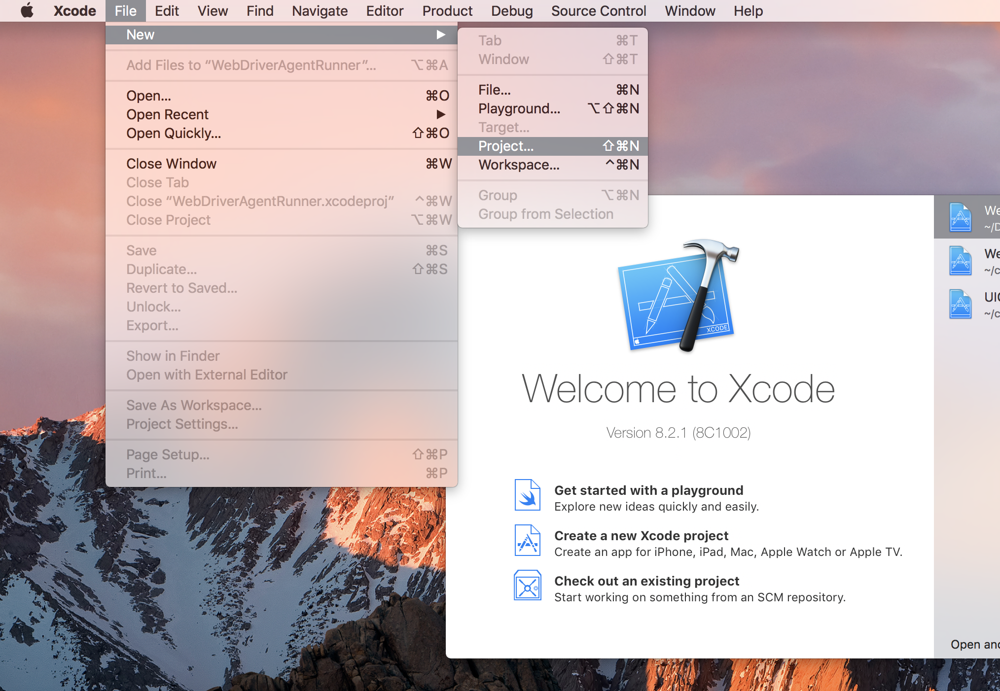
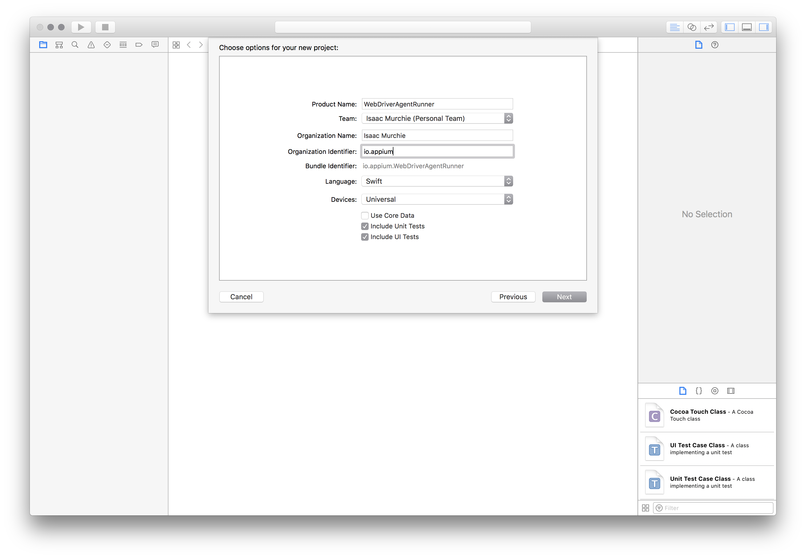
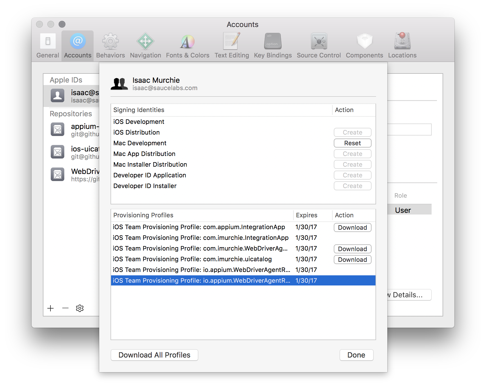
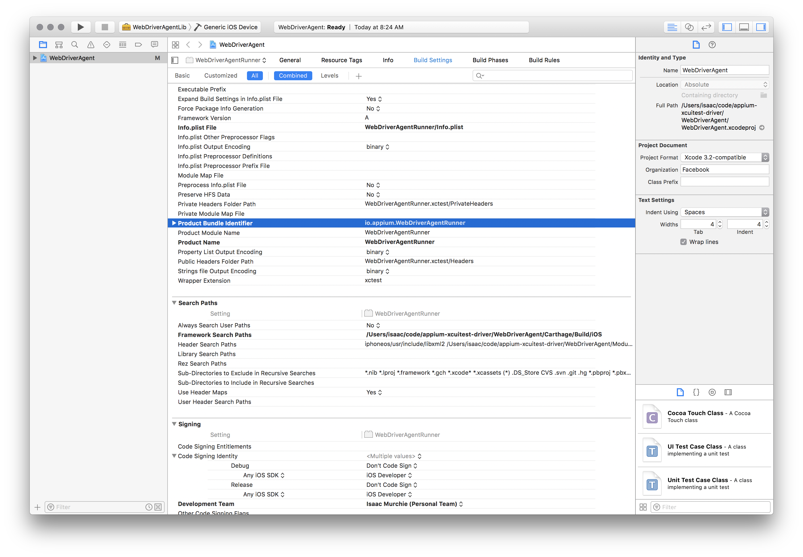

## Appium XCUITest Driver Real Device Setup

### Installing dependencies

Appium iOS real device support depends on a central third-party software suite,
[libimobiledevice](http://www.libimobiledevice.org/), which is easily installable
with [Homebrew](http://brew.sh/):

```
brew install libimobiledevice
```

In addition to the dependency on `libimobiledevice`, Appium support for real
devices running iOS 9.3 and above using Xcode 8+ also depends on `ios-deploy`,
which is easily available through [npm](https://www.npmjs.com/package/ios-deploy) or [Homebrew](http://brew.sh/):

```
npm install -g ios-deploy
```
```
brew install ios-deploy
```

The way that the XCUITest driver works is via the installation of a helper
application called `WebDriverAgent-Runner` onto the device, through which the
application under test is automated. While this is simple in theory, the hoops
of code signing and provisioning applications for development and testing can
make this a bit of a headache.

### Basic (automatic) configuration

The easiest way to get up-and-running with Appium's XCUITest support on iOS
real devices is to use the automatic configuration strategy. There are two ways
to do this:

*   Use the `xcodeOrgId` and `xcodeSigningId` desired capabilities:
```json
    {
      "xcodeOrgId": "<Team ID>",
      "xcodeSigningId": "iPhone Developer"
    }
```
*   Create a `.xcconfig` file somewhere on your file system and add the following to it:
```
    DEVELOPMENT_TEAM = <Team ID>
    CODE_SIGN_IDENTITY = iPhone Developer
```
In either case, the Team ID is a unique 10-character string generated by Apple
that is assigned to your team. You can find your Team ID using your developer
account. Sign in to [developer.apple.com/account](http://developer.apple.com/account),
and click Membership in the sidebar. Your Team ID appears in the Membership
Information section under the team name. You can also find your team ID listed
under the "Organizational Unit" field in your iPhone Developer certificate in
your keychain.

Note that these are mutually exclusive strategies; use _either_ the
`xcodeConfigFile` capability or the combination of `xcodeOrgId` and `xcodeSigningId`.

Once this configuration is done, it should just be a matter of starting your test
specifying a real device in your `udid` desired capability.

If this has not worked it will usually manifest itself in the Appium server logs
as some error followed by `info XCUITest xcodebuild exited with code '65' and
signal 'null'`. This usually means that the necessary code signing is not set up
correctly. Go on to the [Basic (manual) configuration](#basic-manual-configuration)
to fix.

If the `WebDriverAgentRunner` is successfully installed on the device, but in the
Appium logs there is an error message something like:
```
2017-01-24 09:02:18.358 xcodebuild[30385:339674] Error Domain=com.apple.platform.iphoneos Code=-12 "Unable to launch com.apple.test.WebDriverAgentRunner-Runner" UserInfo={NSLocalizedDescription=Unable to launch com.apple.test.WebDriverAgentRunner-Runner, NSUnderlyingError=0x7fa839cadc60 {Error Domain=DTXMessage Code=1 "(null)" UserInfo={DTXExceptionKey=The operation couldn’t be completed. Unable to launch com.apple.test.WebDriverAgentRunner-Runner because it has an invalid code signature, inadequate entitlements or its profile has not been explicitly trusted by the user. : Failed to launch process with bundle identifier 'com.apple.test.WebDriverAgentRunner-Runner'}}}
2017-01-24 09:02:18.358 xcodebuild[30385:339674] Error Domain=IDETestOperationsObserverErrorDomain Code=5 "Early unexpected exit, operation never finished bootstrapping - no restart will be attempted" UserInfo={NSLocalizedDescription=Early unexpected exit, operation never finished bootstrapping - no restart will be attempted}

Testing failed:
	Test target WebDriverAgentRunner encountered an error (Early unexpected exit, operation never finished bootstrapping - no restart will be attempted)
```
The problem is that the developer is not trusted on the device. If you manually
try to run the `WebDriverAgentRunner` app on the device, you will see a popup
message:


You can go to Settings => General => Device Management on the device to trust
the developer and allow the `WebDriverAgentRunner` app to be run (see [Apple
documentation for more information](https://support.apple.com/en-us/HT204460)).


### Basic (manual) configuration

There are many cases in which the basic automatic configuration is not enough. This
usually has to do with code signing and the configuration of the project to be
able to be run on the real device under test. Often this happens when the
development account being used is a "Free" one, in which case it is not possible
to create a wildcard provisioning profile, and will often not create one for the
default application bundle.

This will manifest as something like an error that Xcode **failed to create
provisioning profile**:


The easiest way around this is to create a provisioning profile by opening
[Xcode](https://developer.apple.com/xcode/) and creating a new project:



The type does not matter, other than it being "iOS". "Single View Application"
is the easiest:


The important part is to use a unique "Product Name" and "Organization Name". Also,
at this point, specify your "Team".



You can confirm that the provisioning profile was created by looking at the "Project"
tab:


Or by going into your account preferences and seeing the provisioning profile:



At this point you have a valid provisioning profile. Make note of the bundle id
you associated with it, and add that in the `updatedWDABundleId` desired
capability for your tests. Then follow the [initial instructions for automatic
configuration](#basic-automatic-configuration).


### Full manual configuration

Alternatively, the provisioning profile can be manually associated with the
project (keep in mind that this will have to be done each time the
WebDriverAgent is updated, which includes every time a new version of Appium is
installed, and is _not_ recommended):

*   Find out where your Appium installation is:
```
    $ which appium
    /path/where/installed/bin/appium
```
*   Given this installation location, `/path/where/installed/bin/appium`, `WebDriverAgent`
    will be found in `/path/where/installed/lib/node_modules/appium/node_modules/appium-xcuitest-driver/WebDriverAgent`.
    Open a terminal and go to that location, then run the following in order to
    set the project up:
```
    mkdir -p Resources/WebDriverAgent.bundle
    ./Scripts/bootstrap.sh -d
```
*   Open `WebDriverAgent.xcodeproj` in Xcode. For **both** the `WebDriverAgentLib`
    and `WebDriverAgentRunner` targets, select "Automatically manage signing"
    in the "General" tab, and then select your `Development Team`. This
    should also auto select `Signing Ceritificate`. The outcome should look as
    shown below:

    

    * Xcode may fail to create a provisioning profile for the `WebDriverAgentRunner`
      target:

      

    * This necessitates manually changing the bundle id for the target by going
      into the "Build Settings" tab, and changing the "Product Bundle Identifier"
      from `com.facebook.WebDriverAgentRunner` to something that Xcode will accept:

      

    * Going back to the "General" tab for the `WebDriverAgentRunner` target, you
      should now see that it has created a provisioning profile and all is well:

      

*   Finally, you can verify that everything works. Build the project:
```
    xcodebuild -project WebDriverAgent.xcodeproj -scheme WebDriverAgentRunner -destination 'id=<udid>' test
```
If this was successful, the output should end with something like:
```
    Test Suite 'All tests' started at 2017-01-23 15:49:12.585
    Test Suite 'WebDriverAgentRunner.xctest' started at 2017-01-23 15:49:12.586
    Test Suite 'UITestingUITests' started at 2017-01-23 15:49:12.587
    Test Case '-[UITestingUITests testRunner]' started.
        t =     0.00s     Start Test at 2017-01-23 15:49:12.588
        t =     0.00s     Set Up
```
*   To completely verify, you can try accessing the WebDriverAgent server status
    (**note:** you _must_ be on the same network as the device, and know its IP
    address, from Settings => Wi-Fi => Current Network):
```
    export DEVICE_URL='http://<device IP>:8100'
    export JSON_HEADER='-H "Content-Type: application/json;charset=UTF-8, accept: application/json"'
    curl -X GET $JSON_HEADER $DEVICE_URL/status
```
    You ought to get back output something like this:
```
    {
      "value" : {
        "state" : "success",
        "os" : {
          "name" : "iOS",
          "version" : "10.2"
        },
        "ios" : {
          "simulatorVersion" : "10.2",
          "ip" : "192.168.0.7"
        },
        "build" : {
          "time" : "Jan 23 2017 14:59:57"
        }
      },
      "sessionId" : "8951A6DD-F3AD-410E-A5DB-D042F42F68A7",
      "status" : 0
    }
```

### Configuring the app under test

Not only does WebDriverAgent need to be configured to run on your device, but
your app must also be able to run on your device. The central requirements are
the same: to have a build of your app (an `.ipa` file) signed with
a development provisioning profile. A good overview of the process can be found
[here](https://medium.com/ios-os-x-development/ios-code-signing-provisioning-in-a-nutshell-d5b247760bef#.5hirl92tn)
and
[here](https://engineering.nodesagency.com/articles/iOS/Understanding-code-signing-for-iOS-apps/).

In a little more detail, to get started on a real device, you will need the following:

* An [Apple Developer ID](https://developer.apple.com/programs/ios/) and a valid
Developer Account with a configured development certificate and provisioning
profile.
* A valid iOS Development Certificate and Provisioning Profile are necessary to
test on a real device. Your app will also need to be signed. You can find
information about this in the [Apple documentation](https://developer.apple.com/library/ios/documentation/IDEs/Conceptual/AppDistributionGuide/TestingYouriOSApp/TestingYouriOSApp.html).
* An iPad or iPhone. Make sure this has been set up for development in Xcode.
* A signed `.app` or `.ipa` file of your app, or the source code to build one.
* A Mac with [Xcode](https://developer.apple.com/xcode/) and the Xcode Command
Line Developer Tools.

Appium handles installing the application to the device, using
`ideviceinstaller` (which is installed as part of `libimobiledevice`), but it
is sometimes easier to pre-install your app using Xcode to ensure there are no
problems (see again the [Apple
documentation](https://developer.apple.com/library/content/documentation/IDEs/Conceptual/AppDistributionGuide/TestingYouriOSApp/TestingYouriOSApp.html)
for this).

### Troubleshooting ideas

0. Make sure UDID is correct by checking it in Xcode Organizer or iTunes. It
   is a long string (20+ chars).
0. Make sure that you can run your tests against the Simulator.
0. Make sure UI Automation is enabled on your device. Settings -> Developer ->
   Enable UI Automation
